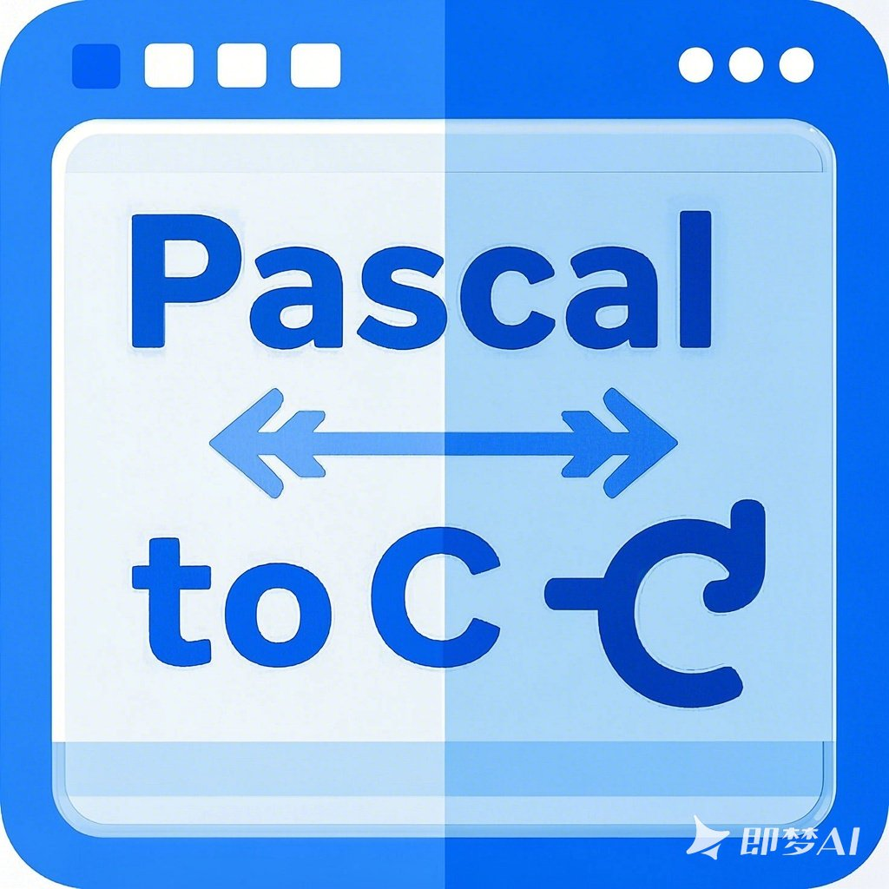

# Pascal2C

## 成员

- Claude-3-7-sonnet(with MCP) $^ \star$
- 成润东 $^ \star$
- 连琎宇 $^ \star$
- 吕志杰 $^ \star$
- 唐梓楠 $^ \star$

> $^\star$ means equal contribution，按字母排序

## 项目文档

[outline](https://compilercourseproject.getoutline.com/home)
